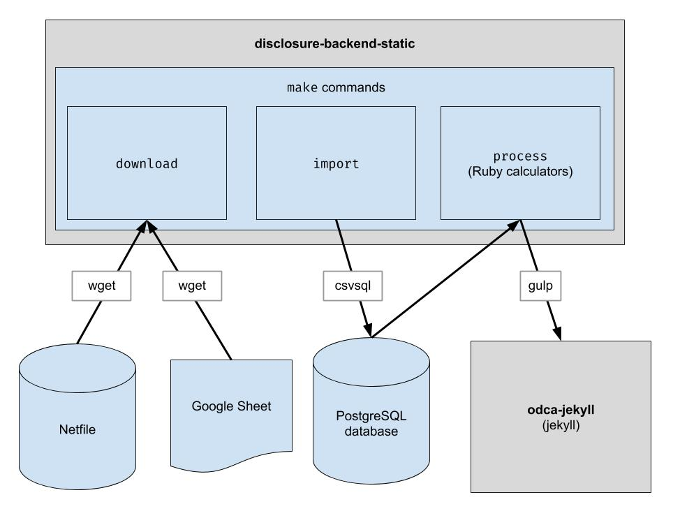

[](https://travis-ci.org/caciviclab/disclosure-backend-static)

# Disclosure Backend Static

The `disclosure-backend-static` repo is the backend powering [Open Disclosure California](https://opendisclosure.io).

It was created in haste running up to the 2016 election, and thus is engineered around a "get it done" philosophy. At that time, we had already designed an API and built (most of) a frontend; this repo was created to implement those as quickly as possible.

This project implements a basic ETL pipeline to download the Oakland netfile
data, download the CSV human-curated data for Oakland, and combine the two. The
output is a directory of JSON files which mimic the existing API structure so
no client code changes will be required.

## Prerequisites

- Ruby (see version in `.ruby-version`)

## Installation

**Note:** You do not need to run these commands to develop on the frontend. All
you need to do is clone the repository adjacent to the frontend repo.

If you'll be changing the backend code, install the development dependencies
with these commands:

```bash
brew install postgresql
sudo pip install -r requirements.txt
gem install pg bundler
bundle install
```

**Note:** It appears there is a problem on Macintosh systems using the Apple Chips.
If, when running ```make import``` you get:
```
ImportError: You don't appear to have the necessary database backend installed for connection string you're trying to use. Available backends include:

PostgreSQL:	pip install psycopg2
```
Try the following:
```
pip uninstall psycopg2-binary
pip install psycopg2-binary --no-cache-dir
```

### Codespaces

This repository is set up to work in a container under Codespaces.  In other words, you can start up an environment that is already set up without having to do any of the installation steps required to set up a local environment.  This can be used as a way to trouble-shoot code before it is committed to the production pipeline.  The following information may be helpful to get started using Codespaces:

1. Go to the page displaying the repository code: https://github.com/caciviclab/disclosure-backend-static
2. Change the branch to the branch that you're interested in running and editing.
3. Click on the `Code` button and click the `Codespaces` tab in the dropdown
4. Click on the button to start a new codespace
5. Wait for the container to be set up and a terminal prompt at `/workspace` to be presented in the web page, which will look familiar if you've worked with VS Code before
6. In the terminal, you can start running the commands from the next section, such as `make download`
7. There will be a running Postgres database started on localhost and you can simply type `psql` in the terminal to connect to the server
8. The `make import` command will populate the Postgres database
9. Click on the cylinder icon on the left to access the SQL Tools extension, which will allow you to connect to Postgres and view its schema as well as query the data that you imported
10. The container has Python 3.9 and a current version of Ruby installed, along with all the required packages
11. We will try to get the container to match the environment for Travis CI, including trying to get the same Ruby version installed
12. This same setup allows anyone to run the same container on their local machine in VS Code using the Dev Containers extension, but we are mainly focused on enabling Codespaces right now and making sure that we can harden the setup for Codespaces first. (We'll be adding instructions for Dev Containers once this is solid)
13. If you make changes in your Codespaces environment, don't forget to push it after committing it with Git.  It is like another machine, so it won't end up in the GitHub repository if don't do a `git push`

## Running

Download the raw data files. You only need to run this once in a while to get
the latest data.

    $ make download

Import the data into the database for easier processing. You only need to run
this after you've downloaded new data.

    $ make import

Run the calculators. Everything is output into the "build" folder.

    $ make process

Optionally, reindex the build outputs into Algolia. (Reindexing requires the
ALGOLIASEARCH_APPLICATION_ID and ALGOLIASEARCH_API_KEY environment variables).

    $ make reindex

If you want to serve the static JSON files via a local web server:

    $ make run

## Developing

### Checking output data changes

This repository is used to generate data files that are used by the website.  After `make process` is run, a `build` directory is generated containing the data files.  This directory is checked in to the repository and later checked out when generating the website.  After making code changes, it is important to compare the generated `build` directory against the `build` directory generated before the code changes and verify that changes from the code changes are as expected.

Because a strict comparison of all contents of the `build` directory will always include changes that occur independent of any code change, every developer has to know about these expected changes in order to perform this check.  To remove the need for this, a specific file, `bin/create-digests.py`, generate digests for JSON data in the `build` directory after excluding these expected changes.  To look for changes that exclude these expected changes, simply look for a change in the `build/digests.json` file.

Currently, these are the expected changes that occur independent of any code change:
* timestamps change for each run
* top contributors lists contain undefined ordering of contributors with the same contribution
* top spenders lists contain undefined ordering of spenders with the same spending
* rounding differences for floats

The expected changes are excluded before generating digests for data in the `build` directory.  The logic for this can be found in the function `clean_data`, found in the file `bin/create-digests.py`.  After the code is modified such that an expected change no longer exists, the exclusion of that change can be removed from `clean_data`.  For example, the rounding of floats are not consistently the same each time `make process` is run, due to differences in the environment.  When the code is fixed so that the rounding of floats is the same as long as the data hasn't changed, the `round_float` call in `clean_data` can be removed.

An additional script has been created to generate a report that enables comparing the totals for candidates.  The script is `bin/report-candidates.py` and it generates `build/candidates.csv` and `build/candidates.xlsx`. The reports include a list of all the candidates and totals calculated multiple ways that should add up to the same number.

### Adding a calculator

Each metric about a candidate is calculated independently. A metric might be
something like "total contributions received" or something more complex like
"percentage of contributions that are less than $100".

When adding a new calculation, a good first place to start is the official [Form
460][form_460]. Is the data are you looking for reported on that form? If so,
you will probably find it in your database after the import process. There are
also a couple other forms that we import, like Form 496. (These are the names of
the files in the `input` directory. Check those out.)

Each schedule of each form is imported into a separate postgres table. For
example, Schedule A of Form 460 is imported into the
`A-Contributions` table.

Now that you have a way of querying the data, you should come up with a SQL
query that calculates the value you are trying to get. Once you can express
your calcualtion as SQL, put it in a calcuator file like so:

1. Create a new file named `calculators/[your_thing]_calculator.rb`
2. Here is some boilerplate for that file:
  ```ruby
  # the name of this class _must_ match the filename of this file, i.e. end
  # with "Calculator" if the file ends with "_calculator.rb"
  class YourThingCalculator
    def initialize(candidates: [], ballot_measures: [], committees: [])
      @candidates = candidates
      @candidates_by_filer_id = @candidates.where('"FPPC" IS NOT NULL')
        .index_by { |candidate| candidate['FPPC'] }
    end

    def fetch
      @results = ActiveRecord::Base.connection.execute(<<-SQL)
        -- your sql query here
      SQL

      @results.each do |row|
        # make sure Filer_ID is returned as a column by your query!
        candidate = @candidates_by_filer_id[row['Filer_ID'].to_i]

        # change this!
        candidate.save_calculation(:your_thing, row[column_with_your_desired_data])
      end
    end
  end
  ```
3. You will want to fill in the SQL query and make sure that the query selects
   the `Filer_ID` column.
4. Make sure to update the call to `candidate.save_calculation`. That method
   will serialize its second argument as JSON, so it can store any kind of data.
5. Your calculation can be retrieved with `candidate.calculation(:your_thing)`.
   You will want to add this into an API response in the `process.rb` file.

## Data flow

This is how the data flows through the back end. Finance data is pulled from
Netfile which is supplemented by a Google Sheet mapping Filer Ids to ballot
information like candidate names, offices, ballot measures, etc. Once data is
filtered, aggregated, and transformed, the front end consumes it and builds the
static HTML front end.



### Common Errors
**During Bundle Install**
```
error: use of undeclared identifier 'LZMA_OK'
```
Try:
```
brew unlink xz
bundle install
brew link xz
```

**During `make download`**
```
wget: command not found
```
Run `brew install wget`.


[form_460]: http://www.fppc.ca.gov/content/dam/fppc/NS-Documents/TAD/Campaign%20Forms/460.pdf
