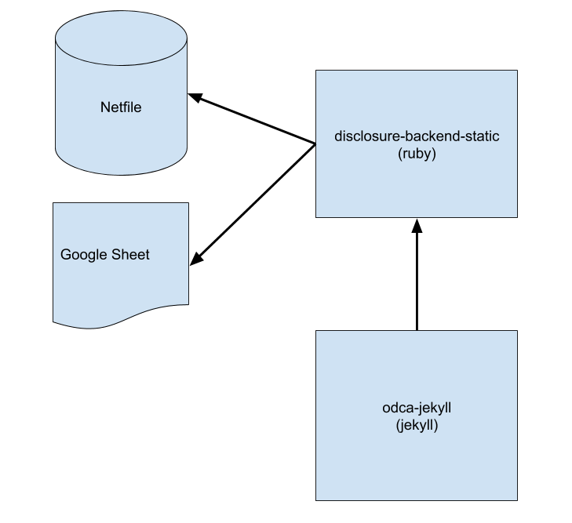

[](https://travis-ci.org/caciviclab/disclosure-backend-static)
[](https://waffle.io/caciviclab/disclosure-backend?utm_source=badge)

# Disclosure Backend Static

The `disclosure-backend-static` repo is the backend powering [Open Disclosure California](https://opendisclosure.io).

It was created in haste running up to the 2016 election, and thus is engineered around a "get it done" philosophy. At that time, we had already designed an API and built (most of) a frontend; this repo was created to implement those as quickly as possible.

This project implements a basic ETL pipeline to download the Oakland netfile
data, download the CSV human-curated data for Oakland, and combine the two. The
output is a directory of JSON files which mimic the existing API structure so
no client code changes will be required.

## Prerequisites

- Ruby (see version in `.ruby-version`)

## Installation

**Note:** You do not need to run these commands to develop on the frontend. All
you need to do is clone the repository adjacent to the frontend repo.

If you'll be changing the backend code, install the development dependencies
with these commands:

```bash
brew install postgresql
sudo pip install -r requirements.txt
gem install pg bundler
bundle install
```

## Running

Download the raw data files. You only need to run this once in a while to get
the latest data.

    $ make download

Import the data into the database for easier processing. You only need to run
this after you've downloaded new data.

    $ make import

Run the calculators.

    $ make process

# everything is output into the "build" folder
```

If you want to serve the static JSON files via a local web server:

```bash
make run
```


## Developing
### Adding a calculator

Each metric about a candidate is calculated independently. A metric might be
something like "total contributions received" or something more complex like
"percentage of contributions that are less than $100".

When adding a new calculation, a good first place to start is the official [Form
460][form_460]. Is the data are you looking for reported on that form? If so,
you will probably find it in your database after the import process. There are
also a couple other forms that we import, like Form 496. (These are the names of
the files in the `input` directory. Check those out.)

Each schedule of each form is imported into a separate postgres table. For
example, Schedule A of Form 460 is imported into the
`A-Contributions` table.

Now that you have a way of querying the data, you should come up with a SQL
query that calculates the value you are trying to get. Once you can express
your calcualtion as SQL, put it in a calcuator file like so:

1. Create a new file named `calculators/[your_thing]_calculator.rb`
2. Here is some boilerplate for that file:
  ```ruby
  # the name of this class _must_ match the filename of this file, i.e. end
  # with "Calculator" if the file ends with "_calculator.rb"
  class YourThingCalculator
    def initialize(candidates: [], ballot_measures: [], committees: [])
      @candidates = candidates
      @candidates_by_filer_id = @candidates.where('"FPPC" IS NOT NULL')
        .index_by { |candidate| candidate['FPPC'] }
    end

    def fetch
      @results = ActiveRecord::Base.connection.execute(<<-SQL)
        -- your sql query here
      SQL

      @results.each do |row|
        # make sure Filer_ID is returned as a column by your query!
        candidate = @candidates_by_filer_id[row['Filer_ID'].to_i]

        # change this!
        candidate.save_calculation(:your_thing, row[column_with_your_desired_data])
      end
    end
  end
  ```
3. You will want to fill in the SQL query and make sure that the query selects
   the `Filer_ID` column.
4. Make sure to update the call to `candidate.save_calculation`. That method
   will serialize its second argument as JSON, so it can store any kind of data.
5. Your calculation can be retrieved with `candidate.calculation(:your_thing)`.
   You will want to add this into an API response in the `process.rb` file.

## Deploying
This is hosted on Tom's personal server, accessible with an API root of

http://disclosure-backend-static.f.tdooner.com

(e.g. http://disclosure-backend-static.f.tdooner.com/office_election/35)

This means that unfortuately, only I can deploy it right now.


## Data flow

This is how the data flows through the back end. Finance data is pulled from
Netfile which is supplemented by a Google Sheet mapping Filer Ids to ballot
information like candidate names, offices, ballot measures, etc. Once data is
filtered, aggregated, and transformed, the front end consumes it and builds the
static HTML front end.



### Common Errors
**During Bundle Install**
```
error: use of undeclared identifier 'LZMA_OK'
```
Try:
```
brew unlink xz
bundle install
brew link xz
```


[form_460]: http://www.fppc.ca.gov/content/dam/fppc/NS-Documents/TAD/Campaign%20Forms/460.pdf
